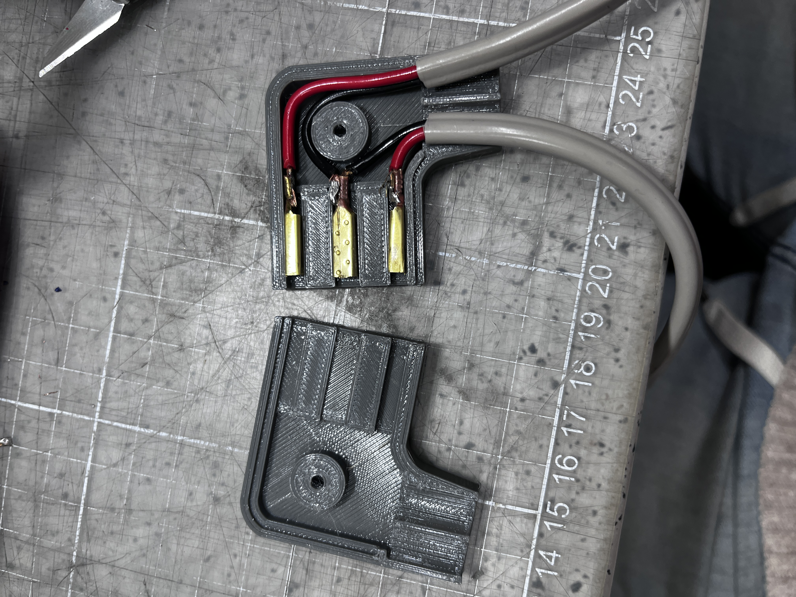
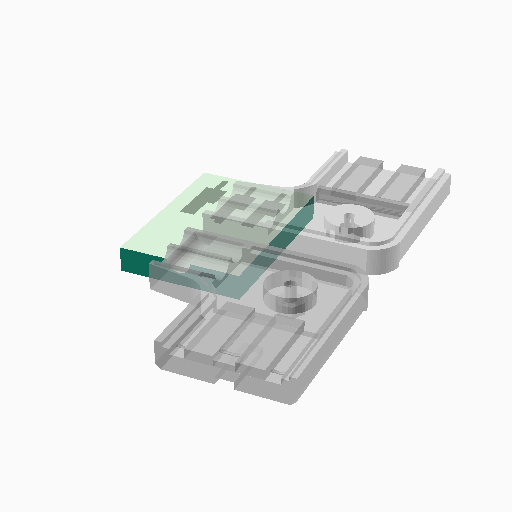

# Elna Sewing Machines - 3D Printable Electrical Plugs

  
  

**⚠️ Ważna Informacja:** Ten projekt jest wyłącznie **modyfikacją (remixem)** istniejącego już projektu i nie jest moim bezpośrednim autorskim dziełem. Pierwotnym autorem pomysłu i głównego modelu wtyczki jest użytkownik **bamckin** z serwisu Thingiverse. 
Oryginalny projekt znajduje się pod adresem: [Elna Sewing Machine Power Plug (Thing: 7199180)](https://www.thingiverse.com/thing:7199180).

Wszystkie zdjęcia poglądowe w folderze `images/` oraz pierwotny plik STL w folderze `stls/` nie należą do mnie. Zostały one dołączone do tego repozytorium wyłącznie w celach referencyjnych i edukacyjnych, jako punkt wyjścia dla opracowanych tu modyfikacji.

---

Parametryczne modele OpenSCAD wtyczek elektrycznych zasilania dla klasycznych maszyn Elna.

## Dostępne wersje wtyczek

W tym repozytorium znajdziesz dwa warianty (znajdujące się w folderze `models/`):

1. **`elna_plug_base.scad`** – Podstawowy model wtyczki bazujący na projekcie Supermatic (2 piny pionowe, 1 pin poziomy). 
2. **`elna_plug_alt_machine.scad`** – Wersja zmodyfikowana dla innej maszyny. Ten model posiada 3 identycznie ułożone (pionowo) szczeliny na piny.

Wyeksportowane modele gotowe do druku (połówki) znajdziesz w folderze `stls/exports/`. Wygenerowane grafiki poglądowe z programu OpenSCAD znajdują się w nowym katalogu `renders/`.

## Wymagania dotyczące druku 3D
Z uwagi na to, że element ten ma bezpośredni kontakt z przewodami pod napięciem (230V) oraz elementami mosiężnymi mogącymi się nagrzewać:
- **NIE UŻYWAJ PLA** (zbyt niska temperatura mięknienia).
- **Zalecane materiały:** PETG, ABS, ASA, PC-Blend.
- Należy zastosować wysokie wypełnienie (np. 50-100% z 4 obrysami), aby wtyczka nie pękła pod naciskiem kabla.

## Montaż Elementów Stykowych
Modele służą wyłącznie jako obudowy. Aby zbudować wtyczkę, należy użyć rurek z mosiądzu lub uniwersalnych wsuwek konektorowych 2.8mm / 4.8mm dociśniętych na zarobionych przewodach.
Po włożeniu zaciśniętych przewodów w odpowiednie kanały wydruku, obie połówki obudowy należy skręcić śrubą M3.

## Licencja
Projekt udostępniany na licencji **GPL-3.0** w zgodzie z zasadami open-source dla projektów pochodnych. Zobacz plik [LICENSE](LICENSE).
