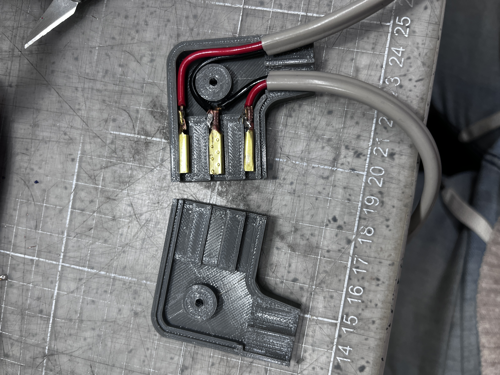
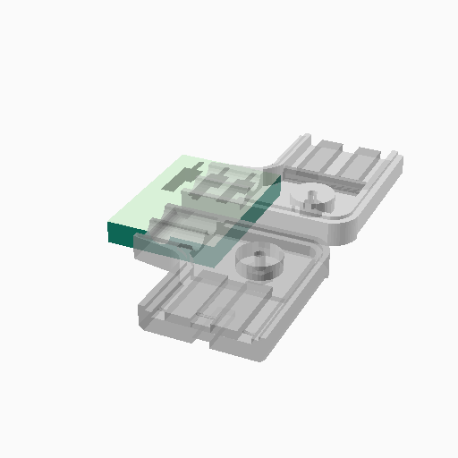

# Elna Sewing Machines - 3D Printable Electrical Plugs

  
  

**⚠️ Important Notice (Ważna Informacja):** This project is exclusively a **modification (remix)** of an existing project and is not my direct original work. The original author of the idea and the main plug model is the user **bamckin** from Thingiverse. 
The original project can be found at: [Elna Sewing Machine Power Plug (Thing: 7199180)](https://www.thingiverse.com/thing:7199180).

All reference photos in the `images/` folder and the original STL file in the `stls/` folder do not belong to me. They have been included in this repository solely for reference and educational purposes, as a starting point for the modifications developed here.

---

A 3D modification of the power plug for Elna sewing machines (SP / Star / Supermatic series). 

This project is a modification (remix) based on the original model [Thingiverse 7199180](https://www.thingiverse.com/thing:7199180) by **bamckin**.

## Modification Specifications (Specyfikacja Modyfikacji)
* **Pin Layout:** All **3 pins are set vertically** (in the original model, the middle pin was horizontal).
* **Pin Axis Spacing:** Exactly **12.7 mm** (half an inch) between the axes of adjacent pins.
* **Internal Chambers:** Profiled to the dimensions of standard brass female connector terminals (all 3 vertical chambers measuring 6.0 mm × 14.0 mm).
* **Cable Routing:** Maintained a spacious chamber for cable routing and a strain relief with clamping teeth at the back of the plug.

## Repository Files (Pliki w Repozytorium)
* `models/elna_plug_modified.scad` – The main OpenSCAD code performing precise modifications on the STL outline.
* `stls/exports/elna_plug_modified_bottom.stl` – The ready-to-print bottom half of the plug.
* `stls/exports/elna_plug_modified_top.stl` – The ready-to-print top half of the plug.
* `renders/` – Rendered preview graphics from OpenSCAD.
* `tools/` – Python scripts used for precise analysis of the STL mesh geometry.

## 3D Printing Requirements (Wymagania dotyczące druku 3D)
Due to the fact that this element has direct contact with live wires (230V) and brass elements that can heat up:
- **DO NOT USE PLA** (too low softening temperature).
- **Recommended materials:** PETG, ABS, ASA, PC-Blend.
- High infill (e.g., 50-100% with 4 perimeters) should be used so the plug does not break under cable pressure.

## Contact Elements Assembly (Montaż Elementów Stykowych)
The models serve solely as housings. To build the plug, you must use brass tubes or universal 2.8mm / 4.8mm female spade connectors crimped on the stripped wires.
After inserting the crimped wires into the appropriate print channels, both halves of the housing should be screwed together with an M3 screw.

## License (Licencja)
The project is released under the **GPL-3.0** license, in accordance with open-source principles for derivative works. See the [LICENSE](LICENSE) file.
